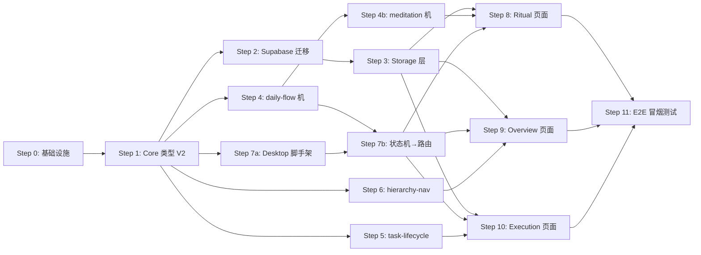

# Phase 1: 确定性核心 — 构建蓝图

**目标**: 工作流引擎 + 基础 UI + 数据层跑通。证明工作流本身好用（无 AI）。
**仓库**: https://github.com/YannJY02/AttentionOS
**总步骤**: 12 步（3 组可并行）
**审查状态**: 已通过 Opus 对抗性审查 (2026-03-24)，修复 3 CRITICAL + 5 HIGH

## 分支策略

```
main              ← 始终可运行（每步 PR 合并后的状态）
  └── phase1/step-N-<slug>   ← 每步一个功能分支
```

**工作流**:
1. 每步开始: `git checkout -b phase1/step-N-<slug>`
2. 开发 + 测试通过 + commit
3. `gh pr create` → 审查（自 review）→ `gh pr merge --squash`
4. 删除功能分支，回到 main

**命名规范**:
- `phase1/step-0-infra`
- `phase1/step-1-core-types`
- `phase1/step-2-supabase-migrations`
- `phase1/step-3-storage-layer`
- `phase1/step-4-daily-flow-machine`
- `phase1/step-4b-meditation-machine`
- `phase1/step-5-task-lifecycle-machine`
- `phase1/step-6-hierarchy-nav-machine`
- `phase1/step-7a-desktop-scaffold`
- `phase1/step-7b-state-route-binding`
- `phase1/step-8-ritual-page`
- `phase1/step-9-overview-page`
- `phase1/step-10-execution-page`
- `phase1/step-11-e2e-smoke`

**main 保护规则**: 每次合并前必须通过 `pnpm check && pnpm test && pnpm lint`

---

## 依赖图



**并行组**:
- 组 A: Steps 2, 4, 5, 6, 7a（均仅依赖 Step 1，互不依赖）
- 组 B: Steps 8, 9, 10（依赖组 A + Step 3 完成，三页面互不依赖）

---

## Step 0: 测试基础设施与环境配置

**模型层级**: default
**依赖**: 无
**预估文件**: 5-6 files, ~80 lines

### 上下文简报

整个 monorepo 的 `package.json` 中 `scripts.test` 引用 `vitest run`，但 Vitest 尚未安装。需要建立全局测试基础设施，以及环境变量模板。

### 任务清单

- [ ] 安装根级测试依赖: `pnpm add -Dw vitest @testing-library/react @testing-library/jest-dom happy-dom`
- [ ] 在 `pnpm-workspace.yaml` 的 catalog 中添加 `vitest` 版本
- [ ] 创建根级 `vitest.workspace.ts` — monorepo 模式配置
- [ ] 为 `packages/core/` 创建 `vitest.config.ts`（Node 环境）
- [ ] 为 `apps/desktop/` 创建 `vitest.config.ts`（happy-dom 环境，支持 React 组件测试）
- [ ] 创建 `.env.example` — 环境变量模板:
  ```
  SUPABASE_URL=http://127.0.0.1:54321
  SUPABASE_ANON_KEY=your-anon-key
  SUPABASE_SERVICE_ROLE_KEY=your-service-role-key
  ```
- [ ] 验证 `.gitignore` 已排除 `.env*`（当前已有 `.env` 排除）
- [ ] 创建占位测试 `packages/core/__tests__/utils.test.ts` 验证 Vitest 可运行

### 验证命令

```bash
pnpm test --filter @attentionos/core  # Vitest 运行通过
```

### 退出标准

- [x] `pnpm test` 可在任意子包运行
- [x] `.env.example` 存在且列出所有必需变量
- [x] 占位测试通过

---

## Step 1: 重构 @attentionos/core 类型适配 V2 数据模型

**模型层级**: strongest（核心类型影响全局）
**依赖**: Step 0
**预估文件**: 5-8 files, ~500 lines net change

### 上下文简报

V1 的 `packages/core/src/types.ts`（754 行）包含大量 V1 专用类型。需要创建 V2 类型并安全隔离 V1 遗留类型。

**关键约束 — 命名冲突**:
V1 `types.ts` 中存在与 V2 同名但含义不同的类型，必须显式处理:
- `WorkflowStage` — V1: `"ritual"|"capture"|"decompose"|...` → V2: `"ritual"|"overview"|"execution"`
- `PlanningLevel` — V1: `"vision"|"area"|"goal"|"project"|"task"` → V2 保留（兼容）
- `WorkflowRoute` — V1 定义存在，V2 不再使用

**重构策略（安全路线）**:
1. 不移动/重命名现有文件 — 避免破坏引擎导入
2. 在 `v2-types.ts` 中定义 V2 新类型（不同名称或带 V2 前缀处理冲突）
3. 在 `index.ts` 中同时 re-export V1 和 V2 类型
4. V1 冲突类型在 `types.ts` 中标记 `@deprecated`
5. `constants.ts` 包含 V2 枚举值和只读映射；`defaults.ts` 保留 V1 配置默认值不动

**V2 保留的 V1 类型**（attention-engine/policy-engine 依赖）:
`AttentionState`, `AttentionObservation`, `PassiveSignal`, `ActiveProbeResult`,
`AttentionStateEstimate`, `SubjectiveEMA`, `NudgeAction`, `NudgeType`, `NudgeDecision`,
`NudgeDecisionContext`, `NudgeStatsSnapshot`, `MRTEnrollment`, `MRTAssignment`,
`InterventionOutcome`, `ExecutionGuardrailConfig`, `PriorityPreemptionConfig`, `ActionRiskLevel`

**V1 遗留（不再使用但保留编译）**:
`CaptureHub*`, `Extension*`, `Planner*`, `WorkItem*`, `AppleIntegration*` 等

### 任务清单

- [ ] 创建 `packages/core/src/v2-types.ts` — V2 统一数据模型类型
  - `V2Entity`, `V2Edge`, `V2AuditLogEntry`, `V2AttentionObservation`
  - `V2WorkflowStage = 'ritual' | 'overview' | 'execution'`
  - `HierarchyLayer = 'vision' | 'area' | 'goal' | 'project' | 'task'`（与 V1 `PlanningLevel` 兼容）
  - `EntityType`, `EntityStatus`, `RelationType` 字面量联合类型
- [ ] 创建 `packages/core/src/constants.ts` — V2 枚举值映射
  - `HIERARCHY_LAYERS`, `ENTITY_TYPES`, `WORKFLOW_STAGES`, `RELATION_TYPES`
  - 状态转移合法性映射 `VALID_STAGE_TRANSITIONS`
- [ ] 在 `types.ts` 中为冲突类型添加 `@deprecated` 注释
- [ ] 更新 `packages/core/src/index.ts` — 同时导出 V1 和 V2
- [ ] 确认 attention-engine 和 policy-engine 的导入不变、编译通过
- [ ] **先写测试**: `packages/core/__tests__/v2-types.test.ts` — `expectTypeOf` 类型测试

### 验证命令

```bash
cd packages/core && pnpm check
cd packages/attention-engine && pnpm check
cd packages/policy-engine && pnpm check
pnpm test --filter @attentionos/core
```

### 退出标准

- [x] V2 核心类型完整定义
- [x] V1 类型未被移动或删除，引擎编译零错误
- [x] 无命名冲突（V2 类型有独立名称或 V1 冲突类型已标记 deprecated）
- [x] 类型测试通过
- [x] `v2-types.ts` < 200 行, `constants.ts` < 100 行

---

## Step 2: Supabase 数据库迁移 — Phase 1 核心表

**模型层级**: default
**依赖**: Step 1
**预估文件**: 3-4 files, ~250 lines

### 上下文简报

按设计文档 §4.1 创建 Phase 1 所需表。Phase 1 不需要 embeddings、ai_suggestions、prompt_templates（Phase 2+）。需要包含 RLS 策略 — Supabase 默认开启 RLS，不配置策略会导致查询返回空结果。

**Phase 1 RLS 策略**: 单用户桌面应用，使用 `service_role_key` 绕过 RLS 进行开发。同时创建基本的 `USING (true)` 策略用于 anon key 访问，后续 Phase 4 再加严。

**attention_observations 表**: 此表在 Phase 1 创建但主要供 Phase 2 使用。Phase 1 中注意力引擎是纯函数，不写数据库。

### 任务清单

- [ ] 创建 `supabase/migrations/0001_create_entities.sql`
  - entities 表 + 所有 Phase 1 索引 + FTS 生成列 + RLS 策略
- [ ] 创建 `supabase/migrations/0002_create_edges_and_audit.sql`
  - edges 表 + audit_log 表 + attention_observations 表 + 索引 + RLS 策略
- [ ] 创建 `supabase/migrations/0003_enable_rls.sql`
  - 所有表启用 RLS + 基础开放策略
- [ ] 验证 SQL 语法正确性

### 验证命令

```bash
# 如有 Docker + Supabase CLI:
npx supabase start && npx supabase db reset
# 无 Docker 时手动审查 SQL 语法
```

### 退出标准

- [x] 迁移文件覆盖 entities、edges、audit_log、attention_observations
- [x] 索引与设计文档 §4.2 一致
- [x] 每表有 RLS 策略
- [x] SQL 语法正确

---

## Step 3: @attentionos/storage — Repository Pattern 数据层

**模型层级**: default
**依赖**: Step 1, Step 2
**预估文件**: 8-10 files, ~600 lines

### 上下文简报

实现 Repository Pattern 封装 Supabase 数据访问。接口设计支持后续替换底层（PowerSync + SQLite）。Phase 1 使用 `service_role_key` 初始化客户端（绕过 RLS，简化开发）。

**依赖安装**: 需要 `@supabase/supabase-js`。

**测试拆分策略**: EntityRepository 测试较大，拆为 query 和 mutation 两个文件。提取 mock 工厂到 `__tests__/helpers/mock-supabase.ts` 复用。

### 任务清单

- [ ] 安装: `pnpm add @supabase/supabase-js --filter @attentionos/storage`
- [ ] 创建 `packages/storage/src/supabase.ts` — Supabase 客户端 + 启动时环境变量校验
- [ ] 创建 `packages/storage/src/types.ts` — Repository 接口定义 (IEntityRepository 等)
- [ ] **先写测试**: `packages/storage/__tests__/helpers/mock-supabase.ts` — mock 工厂
- [ ] **先写测试**: `packages/storage/__tests__/entity.query.test.ts`
- [ ] **先写测试**: `packages/storage/__tests__/entity.mutation.test.ts`
- [ ] 创建 `packages/storage/src/repositories/entity.ts` — CRUD + 查询
- [ ] **先写测试** + 实现 `packages/storage/src/repositories/edge.ts`
- [ ] **先写测试** + 实现 `packages/storage/src/repositories/audit.ts`
- [ ] 更新 `packages/storage/src/index.ts` — 统一导出
- [ ] 创建 `packages/storage/vitest.config.ts`

### 验证命令

```bash
pnpm test --filter @attentionos/storage
cd packages/storage && pnpm check
```

### 退出标准

- [x] EntityRepository: create, findById, findAll, update, archive
- [x] EdgeRepository: create, findBySource, findByTarget, delete
- [x] AuditRepository: log, findByTarget, findByActor
- [x] 每个方法有对应测试（mock Supabase，非集成测试）
- [x] 不可变模式：所有方法返回新对象
- [x] supabase.ts 包含环境变量验证（缺失时 fail fast）
- [x] 无单文件超 400 行

---

## Step 4: XState daily-flow 状态机 — ritual → overview → execution

**模型层级**: strongest（核心架构）
**依赖**: Step 1
**可并行**: Steps 2, 5, 6, 7a

### 上下文简报

整个系统的主状态机。控制用户在三个工作流阶段间的转换。每个阶段有子状态（如 ritual 包含 meditation → reflection → dedication）。

**架构约束**:
- 状态机定义纯函数式，不依赖 UI 框架
- daily-flow 的 context 仅包含阶段元数据（当前子阶段、时间戳、sessionId），**不包含**任务详情
- 跨状态机通信通过事件，不通过 context 引用（避免循环依赖）

设计文档 §2 L3 层:
- ritual: meditation → reflection → dedication → 完成后切换到 overview
- overview: 全局纵览 → 选择任务后切换到 execution
- execution: 执行中 → 完成后可回 overview 或 ritual

### 任务清单

- [ ] 安装: `pnpm add xstate --filter @attentionos/machines`
- [ ] 安装测试依赖: `pnpm add -D vitest --filter @attentionos/machines`
- [ ] 创建 `packages/machines/vitest.config.ts`
- [ ] **先写测试**: `packages/machines/__tests__/daily-flow.test.ts`
  - 测试所有合法转移（ritual→overview→execution→ritual）
  - 测试非法转移被拒绝
  - 测试 ritual 子状态（meditation→reflection→dedication）
  - 测试 context 数据流
- [ ] 创建 `packages/machines/src/daily-flow.ts` — 状态机定义
- [ ] 更新 `packages/machines/src/index.ts` 导出

### 验证命令

```bash
pnpm test --filter @attentionos/machines
cd packages/machines && pnpm check
```

### 退出标准

- [x] 状态机定义 < 300 行
- [x] 所有合法转移有测试覆盖
- [x] 所有非法转移有测试覆盖
- [x] Guards 纯函数，无副作用
- [x] context 不包含任务详情（无循环依赖风险）
- [x] 100% 状态转移测试覆盖

---

## Step 4b: XState meditation 状态机 — 冥想计时器

**模型层级**: default
**依赖**: Step 4
**可并行**: Steps 5, 6

### 上下文简报

设计文档 monorepo 结构明确列出 `packages/machines/src/meditation.ts`。冥想计时器的状态管理必须由 XState 控制（"确定性核心"原则），不能用 React useState/useEffect。

此状态机作为 daily-flow 的 ritual.meditation 子阶段的内部 actor 调用。

### 任务清单

- [ ] **先写测试**: `packages/machines/__tests__/meditation.test.ts`
  - idle → meditating → completed（正常流程）
  - meditating ↔ paused（暂停/恢复）
  - 时间追踪正确
- [ ] 创建 `packages/machines/src/meditation.ts`
  - States: idle → meditating → paused → completed
  - Events: START(durationMs), PAUSE, RESUME, TICK, COMPLETE
  - Context: durationMs, elapsedMs, startedAt
- [ ] 在 daily-flow 中将 meditation 作为 invoked actor 集成
- [ ] 导出到 index.ts

### 验证命令

```bash
pnpm test --filter @attentionos/machines
```

### 退出标准

- [x] 冥想完整生命周期测试通过
- [x] 暂停/恢复保持已用时间
- [x] 与 daily-flow 集成后 ritual 子状态正确流转
- [x] 100% 转移测试覆盖

---

## Step 5: XState task-lifecycle 状态机 — plan → execute → review → done

**模型层级**: default
**依赖**: Step 1
**可并行**: Steps 2, 4, 6, 7a

### 上下文简报

任务生命周期管理。每个任务实体从创建到完成的状态流转。支持暂停、恢复、取消。

### 任务清单

- [ ] **先写测试**: `packages/machines/__tests__/task-lifecycle.test.ts`
  - 完整生命周期: idle → planning → executing → reviewing → done
  - 取消: 任意可取消状态 → cancelled
  - pause/resume 在 executing 和 reviewing 状态
- [ ] 创建 `packages/machines/src/task-lifecycle.ts`
  - Context: taskId, title, estimatedMinutes, actualMinutes, startedAt
- [ ] 导出到 index.ts

### 验证命令

```bash
pnpm test --filter @attentionos/machines
```

### 退出标准

- [x] 完整生命周期覆盖（create → done、create → cancel）
- [x] pause/resume 在 executing 和 reviewing 状态可用
- [x] 100% 转移测试覆盖

---

## Step 6: XState hierarchy-nav 状态机 — 五层导航

**模型层级**: default
**依赖**: Step 1
**可并行**: Steps 2, 4, 5, 7a

### 上下文简报

五层目标导航：vision ↔ area ↔ goal ↔ project ↔ task。用户可在层级间上下钻取。

### 任务清单

- [ ] **先写测试**: `packages/machines/__tests__/hierarchy-nav.test.ts`
  - 5 层均可达
  - 上下钻取边界正确
  - breadcrumb 维护
- [ ] 创建 `packages/machines/src/hierarchy-nav.ts`
  - States: vision | area | goal | project | task
  - Events: DRILL_DOWN(entityId) → 下钻, DRILL_UP → 上钻
  - Context: currentLayer, selectedEntityId, breadcrumb[]
- [ ] 导出到 index.ts

### 验证命令

```bash
pnpm test --filter @attentionos/machines
```

### 退出标准

- [x] 5 层状态均可达
- [x] vision 不能再上，task 不能再下
- [x] breadcrumb 正确维护
- [x] 100% 转移测试覆盖

---

## Step 7a: Desktop 应用脚手架 — Tailwind + shadcn/ui + 路由骨架

**模型层级**: default
**依赖**: Step 1
**可并行**: Steps 2-6

### 上下文简报

将 Tauri 默认模板改造为 AttentionOS 桌面应用框架。安装 UI 基础设施，创建布局和路由骨架。**不连接状态机**（状态机连接在 Step 7b）。

当前 `apps/desktop/package.json` 仅有 React 19 + Tauri 依赖，需要安装所有 UI 相关库。

**Vite workspace 配置**: 因为 `@attentionos/*` 包的 `main` 指向 `.ts` 源码，Vite 需要配置 `optimizeDeps.include` 或使用 `vite-tsconfig-paths` 解析 workspace 包。

### 任务清单

- [ ] 安装依赖:
  ```bash
  pnpm add react-router-dom @attentionos/core @attentionos/machines @attentionos/storage --filter @attentionos/desktop
  pnpm add -D tailwindcss @tailwindcss/vite --filter @attentionos/desktop
  npx shadcn@latest init  # 在 apps/desktop 下
  ```
- [ ] 配置 `vite.config.ts` — 添加 Tailwind 插件 + workspace 包解析
- [ ] 创建 `apps/desktop/src/components/layout/Shell.tsx` — 主布局
- [ ] 创建 `apps/desktop/src/components/layout/Sidebar.tsx` — 侧边栏导航
- [ ] 创建路由结构 (`apps/desktop/src/router.tsx`):
  - `/ritual` → RitualPage（占位）
  - `/overview` → OverviewPage（占位）
  - `/execution` → ExecutionPage（占位）
- [ ] 创建三个页面占位组件
- [ ] 清理 Tauri 默认模板内容（App.tsx, App.css 等）

### 验证命令

```bash
cd apps/desktop && pnpm build  # Vite 构建
```

### 退出标准

- [x] 三个路由可访问
- [x] Shell 布局包含侧边栏导航
- [x] Tailwind + shadcn/ui 组件正常渲染
- [x] Vite 构建零错误

---

## Step 7b: 状态机→路由连接

**模型层级**: default
**依赖**: Steps 4, 7a

### 上下文简报

将 daily-flow 状态机与 React Router 连接。状态机状态变化驱动路由跳转，路由变化同步到状态机。

### 任务清单

- [ ] 安装: `pnpm add @xstate/react --filter @attentionos/desktop`
- [ ] 创建 `apps/desktop/src/hooks/useDailyFlow.ts` — XState + React 绑定
- [ ] 创建 `apps/desktop/src/hooks/useRouteSync.ts` — 状态机 ↔ 路由同步
- [ ] **先写测试**: `apps/desktop/__tests__/hooks/useRouteSync.test.ts`
- [ ] 更新 Shell 组件使用状态机驱动

### 验证命令

```bash
cd apps/desktop && pnpm build
pnpm test --filter @attentionos/desktop
```

### 退出标准

- [x] 状态机状态变化 → 路由自动跳转
- [x] 侧边栏高亮当前阶段
- [x] hook 测试通过

---

## Step 8: Ritual 页面 — 冥想/反思/回向

**模型层级**: default
**依赖**: Steps 3, 4b, 7b
**可并行**: Steps 9, 10

### 上下文简报

Ritual 阶段包含三个子步骤：冥想（计时器）→ 反思（文本输入）→ 回向（确认）。UI 由 daily-flow 状态机的 ritual 子状态 + meditation actor 驱动。

### 任务清单

- [ ] **先写测试**: `apps/desktop/__tests__/pages/ritual.test.tsx`
  - 测试 useDailyFlow hook 的状态机连接
  - 测试子步骤条件渲染
  - 测试冥想完成后触发下一步
- [ ] 创建 `apps/desktop/src/pages/ritual/MeditationStep.tsx` — 冥想计时器 UI
- [ ] 创建 `apps/desktop/src/pages/ritual/ReflectionStep.tsx` — 反思文本输入
- [ ] 创建 `apps/desktop/src/pages/ritual/DedicationStep.tsx` — 回向确认
- [ ] 更新 RitualPage 根据子状态渲染对应组件
- [ ] 反思内容保存到 entities 表（type='reflection'）via storage 层

### 验证命令

```bash
cd apps/desktop && pnpm build
pnpm test --filter @attentionos/desktop
```

### 退出标准

- [x] 冥想计时器可启动/暂停/完成（由 meditation 状态机驱动）
- [x] 反思文本可输入并保存
- [x] 回向完成后自动跳转 overview
- [x] 状态机驱动所有步骤转换
- [x] hook 和条件渲染测试通过

---

## Step 9: Overview 页面 — 五层纵览

**模型层级**: default
**依赖**: Steps 3, 6, 7b
**可并行**: Steps 8, 10

### 上下文简报

纵览页面显示五层目标体系。使用 hierarchy-nav 状态机驱动层级导航。

### 任务清单

- [ ] **先写测试**: `apps/desktop/__tests__/pages/overview.test.tsx`
  - 测试 useHierarchyNav hook
  - 测试面包屑渲染
  - 测试钻取到 task 层显示"执行"按钮
- [ ] 创建 `apps/desktop/src/hooks/useHierarchyNav.ts` — 连接状态机
- [ ] 创建 `apps/desktop/src/pages/overview/HierarchyBreadcrumb.tsx`
- [ ] 创建 `apps/desktop/src/pages/overview/EntityList.tsx`
- [ ] 创建 `apps/desktop/src/pages/overview/EntityCard.tsx`
- [ ] 钻取到 task 层级时，显示"开始执行"按钮 → 切换到 execution

### 验证命令

```bash
cd apps/desktop && pnpm build
pnpm test --filter @attentionos/desktop
```

### 退出标准

- [x] 五层导航可上下钻取
- [x] 面包屑正确显示当前路径
- [x] 实体列表从 storage 层加载
- [x] hook 测试通过

---

## Step 10: Execution 页面 — 规划与执行

**模型层级**: default
**依赖**: Steps 3, 5, 7b
**可并行**: Steps 8, 9

### 上下文简报

执行页面由 task-lifecycle 状态机驱动。用户可推进任务状态。

### 任务清单

- [ ] **先写测试**: `apps/desktop/__tests__/pages/execution.test.tsx`
  - 测试 useTaskLifecycle hook
  - 测试状态按钮条件渲染
  - 测试完成后触发路由跳转
- [ ] 创建 `apps/desktop/src/hooks/useTaskLifecycle.ts` — 连接状态机
- [ ] 创建 `apps/desktop/src/pages/execution/TaskDetail.tsx`
- [ ] 创建 `apps/desktop/src/pages/execution/TaskActions.tsx`
- [ ] 创建 `apps/desktop/src/pages/execution/TaskTimer.tsx`
- [ ] 任务完成后 → 回到 overview
- [ ] 操作写入 audit_log

### 验证命令

```bash
cd apps/desktop && pnpm build
pnpm test --filter @attentionos/desktop
```

### 退出标准

- [x] 任务状态可推进（plan → execute → review → done）
- [x] 计时器在 executing 状态运行
- [x] 完成后自动返回 overview
- [x] 所有状态变更记录到 audit_log
- [x] hook 和组件测试通过

---

## Step 11: E2E 冒烟测试 — ritual → overview → execution 全链路

**模型层级**: default
**依赖**: Steps 8, 9, 10

### 上下文简报

Phase 1 最终验证步骤。用 Playwright 编写一个端到端冒烟测试，证明"工作流本身好用"。

### 任务清单

- [ ] 安装: `pnpm add -Dw @playwright/test`
- [ ] 初始化: `npx playwright install --with-deps chromium`
- [ ] 创建 `playwright.config.ts`
- [ ] 创建 `e2e/smoke.spec.ts`:
  - 启动应用 → ritual 页面渲染
  - 完成冥想 → 反思 → 回向
  - 自动跳转 overview
  - 导航到 task 层级 → 进入 execution
  - 推进任务到 done → 返回 overview
- [ ] 在 `package.json` 添加 `"e2e": "playwright test"` 脚本

### 验证命令

```bash
pnpm e2e
```

### 退出标准

- [x] 冒烟测试通过
- [x] ritual → overview → execution 全链路可运行
- [x] Phase 1 "工作流可用" 目标得到端到端验证

---

## 不变量（每步验证后检查）

1. `pnpm check` — 全仓库 TypeScript 类型检查通过
2. `pnpm test` — 所有测试通过
3. `pnpm lint` — Biome 零 error（warn 可接受）
4. 无文件超过 400 行: `find . -name '*.ts' -name '*.tsx' -not -path '*/node_modules/*' | xargs wc -l | awk '$1 > 400'`
5. 无硬编码密钥或凭证

## 回滚策略

每步完成后立即 commit。如需回滚：
```bash
git log --oneline         # 找到目标 commit
git revert <commit-hash>  # 安全回滚
```

## 执行顺序建议

| 会话 | 步骤 | 模式 | 说明 |
|------|------|------|------|
| Session 1 | Step 0 + Step 1 | 串行 | 基础设施 + Core 类型重构 |
| Session 2 | Steps 4 + 4b + 5 + 6 | 并行 | 四个状态机（TDD） |
| Session 3 | Step 2 + Step 3 | 串行 | 数据库迁移 + Storage 层 |
| Session 4 | Step 7a + Step 7b | 串行 | Desktop 脚手架 + 状态机连接 |
| Session 5 | Steps 8 + 9 + 10 | 并行 | 三个页面（TDD） |
| Session 6 | Step 11 | 串行 | E2E 冒烟测试（Phase 1 验收） |
