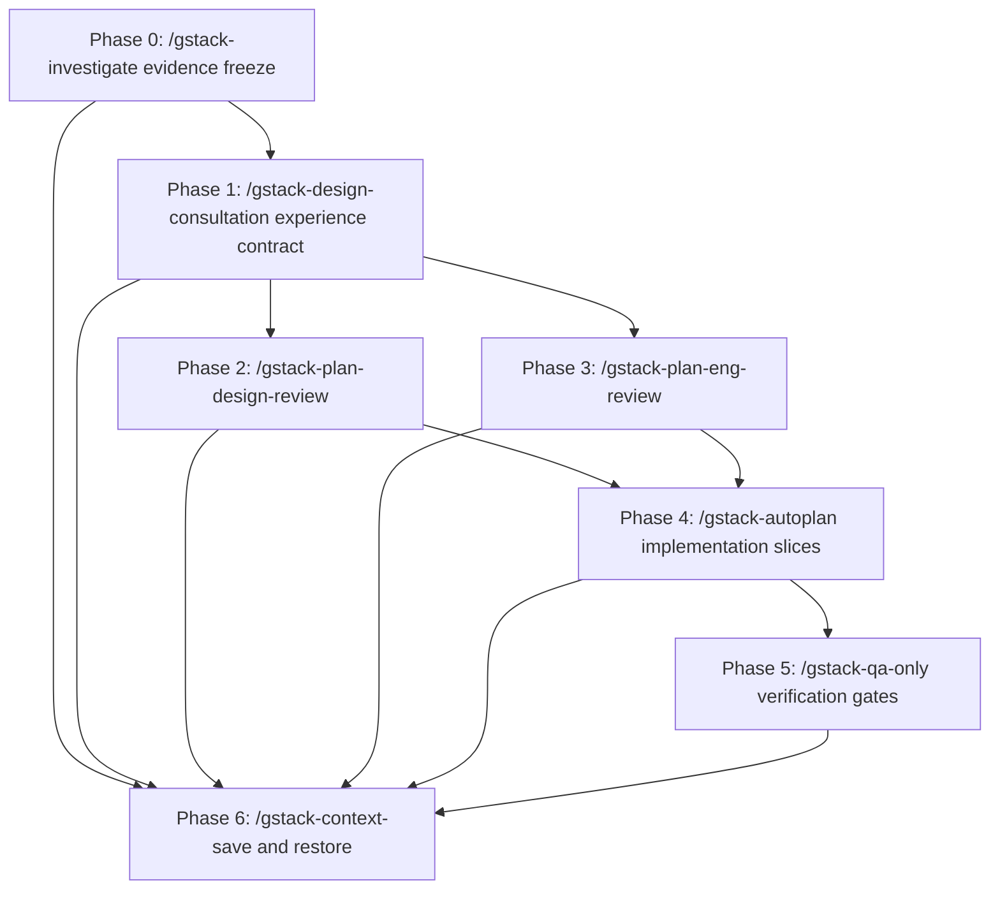

# AttentionOS Experience Alignment Blueprint

## Executive Summary

This blueprint plans the work required to move AttentionOS from a functional
engineering scaffold to a coherent Personal Attention OS experience. The current
architecture direction is not treated as globally wrong: the deterministic
XState workflow, human-reviewed AI suggestion boundary, and Phase 4 protocol
intake remain valuable. The immediate gap is that the real frontend experience
does not yet express the product baseline: attention control, low-friction
workflow switching, and stage-specific meaning.

This document is a planning artifact only. It does not authorize code changes by
itself, does not accept new architecture decisions, and does not expand Phase 4
into broad MCP, SDK, plugin, or offline-sync implementation.

## Phase Status

| Phase | Required skill | Status | Output |
|---|---|---|---|
| 0 | `/gstack-investigate` | Complete | `docs/plans/2026-05-10-attentionos-experience-alignment-evidence-ledger.md` |
| 1 | `/gstack-design-consultation` | Complete | `docs/plans/2026-05-10-attentionos-experience-alignment-contract.md` |
| 2 | `/gstack-plan-design-review` | Complete | D1-D5 and Phase 2 review result recorded in `docs/plans/2026-05-10-attentionos-experience-alignment-contract.md` |
| 3 | `/gstack-plan-eng-review` | Complete | E1-E5, failure modes, and test plan recorded in `docs/plans/2026-05-10-attentionos-experience-alignment-contract.md` |
| 4 | `/gstack-autoplan` | Complete | `docs/plans/2026-05-13-attentionos-experience-alignment-implementation-slice.md` |
| 5 | `/gstack-qa-only` | Complete for implemented slices | QA reports exist for the Execution Plan/Focus slice, Ritual semantic correction slice, and Overview read-only scan slice. |
| 6 | `/gstack-context-save` / `/gstack-context-restore` | Partial | Context saved at `.gstack/projects/YannJY02-AttentionOS/checkpoints/20260510-220217-attentionos-experience-alignment-gates.md` and later slice checkpoints; restore runs at resume boundaries. |

## Evidence Sources

- `docs/governance/project-state.md`
- `docs/README.md`
- `docs/product/MASTER_PRODUCT_PLAN.zh-CN.md`
- `docs/workflow/WORKFLOW_CANONICAL_MODEL.zh-CN.md`
- `docs/plans/2026-05-09-phase-2-ai-reasoning-contract.md`
- `docs/plans/2026-05-09-phase-3-evolutionary-learning-ledger.md`
- `docs/plans/2026-05-09-phase-4-intake.md`
- `apps/desktop/src/components/layout/Shell.tsx`
- `apps/desktop/src/pages/RitualPage.tsx`
- `apps/desktop/src/pages/OverviewPage.tsx`
- `apps/desktop/src/pages/ExecutionPage.tsx`
- `apps/desktop/src/storage/hierarchy.ts`
- `packages/machines/src/daily-flow.ts`
- `packages/machines/src/hierarchy-nav.ts`
- `docs/plans/2026-05-10-attentionos-experience-alignment-evidence-ledger.md`
- `docs/plans/2026-05-10-attentionos-experience-alignment-contract.md`
- `docs/plans/2026-05-10-attentionos-experience-alignment-review-gate-blocker.md`
- Prior local UI capture evidence from `http://127.0.0.1:1420/`, including
  desktop Ritual, Overview, Execution screenshots and a mobile Overview layout
  failure.

## Preserved Invariants

- `ritual / overview / execution` remains the canonical three-stage model.
- `vision / area / goal / project / task` remains the canonical five-layer
  hierarchy.
- `overview` remains read-only.
- `execution` owns planning and focus actions.
- XState remains the deterministic workflow authority.
- AI suggestions remain pending and human-reviewed until the user approves or
  rejects them.
- Phase 4 remains draft intake only until an implementation contract is accepted.
- Long-lived plans live under `docs/plans/`; do not recreate root-level `plans/`.

## Current Gaps

| Gap | Evidence | Risk |
|---|---|---|
| The UI reads like an engineering scaffold rather than an attention operating system. | Sidebar and footer text emphasize deterministic core and AI review instead of user state and workflow meaning. | High |
| Ritual semantics are too thin. | Product/workflow docs describe prayer, meditation, reflection, and dedication; current UI begins with Meditation and describes state-machine control. | High |
| Overview lacks stage-specific judgment. | It shows generic metric cards and entity cards, but not a strong read-only scan, risk prompt, timeline, or layer-specific visual meaning. | High |
| Execution does not clearly separate `execution(plan)` from `execution(focus)`. | Current page combines planning state, timer, task controls, AI decomposition, and evolution suggestions in one surface. | Medium |
| Mobile layout is broken. | The shell uses a fixed desktop grid and the mobile capture squeezes main content into a narrow column. | High |
| Phase 4 could be over-expanded if experience work is confused with protocol work. | Current project-state says Phase 4 scope/security decisions are not finalized. | High |

## Mandatory /gstack Skill Contract

Every phase below has a required `/gstack` skill. A phase is not considered
started until that exact skill is invoked by the executing agent. A phase is not
considered complete until the skill's expected output is produced and the gate is
met. If the skill is unavailable, blocked, or cannot run cleanly, stop and report
the blocker rather than substituting generic reasoning.

| Phase | Required skill | Purpose |
|---|---|---|
| 0 | `/gstack-investigate` | Establish evidence and root causes before design or implementation. |
| 1 | `/gstack-design-consultation` | Translate product principles into an experience contract. |
| 2 | `/gstack-plan-design-review` | Review the design plan before implementation. |
| 3 | `/gstack-plan-eng-review` | Review state, data, route, and AI boundaries. |
| 4 | `/gstack-autoplan` | Convert approved decisions into one-PR-sized implementation slices. |
| 5 | `/gstack-qa-only` | Define and run report-only verification gates after each slice. |
| 6 | `/gstack-context-save` and `/gstack-context-restore` | Preserve and restore decisions across sessions. |

## Dependency Graph



Phases 2 and 3 may run in parallel after Phase 1, but only if both reviewers use
the same experience contract as input and neither edits the plan silently. Phase
4 must wait for both reviews.

## Phase 0: Evidence And Baseline Freeze

Required skill: `/gstack-investigate`

### Context Brief

AttentionOS already has a documented product baseline, a canonical workflow
model, implemented XState machines, local desktop UI surfaces, Phase 2 AI
reasoning contracts, Phase 3 evolutionary learning, and a draft Phase 4 intake.
The observed problem is not a single bug. It is a product-to-frontend alignment
gap with possible architecture implications.

### Required Inputs

- `docs/governance/project-state.md`
- `docs/product/MASTER_PRODUCT_PLAN.zh-CN.md`
- `docs/workflow/WORKFLOW_CANONICAL_MODEL.zh-CN.md`
- `docs/plans/2026-05-09-phase-2-ai-reasoning-contract.md`
- `docs/plans/2026-05-09-phase-3-evolutionary-learning-ledger.md`
- `docs/plans/2026-05-09-phase-4-intake.md`
- `apps/desktop/src/components/layout/Shell.tsx`
- `apps/desktop/src/pages/RitualPage.tsx`
- `apps/desktop/src/pages/OverviewPage.tsx`
- `apps/desktop/src/pages/ExecutionPage.tsx`
- `packages/machines/src/daily-flow.ts`
- `packages/machines/src/hierarchy-nav.ts`
- Fresh desktop and mobile UI captures.

### Tasks

1. Verify current branch, remote, and worktree status.
2. Capture or refresh desktop screenshots for Ritual, Overview, and Execution.
3. Capture or refresh mobile screenshots for at least Overview and Execution.
4. Produce an evidence ledger separating product, workflow, UI, state-machine,
   AI, storage, and Phase 4 issues.
5. Identify which parts of the current system must be preserved.
6. Identify confirmed root causes, not just visible symptoms.

### Expected Output

- Evidence ledger.
- Current-state summary.
- Preserved invariants.
- Root-cause map for experience, UI, state, AI, and Phase 4 boundaries.

### Gate

Proceed only when the root-cause map clearly distinguishes:

- product intent gaps,
- UX and visual gaps,
- frontend implementation gaps,
- state-machine gaps,
- AI/HITL boundary gaps,
- Phase 4 scope risks.

### Do Not Do

- Do not write product or workflow baseline changes.
- Do not edit code.
- Do not treat mobile layout as the entire problem.
- Do not start Phase 4 protocol implementation.

## Phase 1: Experience Alignment Contract

Required skill: `/gstack-design-consultation`

### Context Brief

The product baseline defines AttentionOS as a personal attention and workflow
operating system. It is not primarily a generic project dashboard. The design
contract must tell future implementers how the product should feel and behave at
each stage before any UI components are changed.

### Required Inputs

- Phase 0 evidence ledger.
- Product baseline.
- Workflow semantic baseline.
- Current desktop and mobile screenshots.
- Current page/component structure.

### Tasks

1. Define the experience contract for `ritual`.
2. Define the experience contract for `overview`.
3. Define the experience contract for `execution(plan)`.
4. Define the experience contract for `execution(focus)`.
5. Define visual semantics for `vision`, `area`, `goal`, `project`, and `task`.
6. Define how AI suggestions may appear without increasing attention cost.
7. Define mobile and desktop expectations.

### Required Contract Fields Per Stage

- User state.
- Primary question the UI answers.
- Allowed actions.
- Forbidden actions.
- Visual semantics.
- Data shown by default.
- Data hidden by default.
- AI behavior boundary.
- Acceptance criteria.

### Expected Output

- Experience alignment contract under `docs/plans/` or a dedicated section added
  to this blueprint.
- Open design decisions marked as unresolved, not silently decided.

### Gate

Proceed only when every stage has a complete contract and the contract preserves
overview read-only semantics, human-led AI, and five-layer separation.

### Do Not Do

- Do not jump into component implementation.
- Do not make a generic design system detached from workflow semantics.
- Do not decide controversial product-language changes without owner review.

## Phase 2: Design Plan Review

Required skill: `/gstack-plan-design-review`

### Context Brief

The design plan must be reviewed before implementation because the current
problem is partly that correct engineering surfaces are not expressing the
product model. This phase tests whether the proposed experience contract can
become a real UI without turning into a generic dashboard.

### Required Inputs

- Phase 1 experience contract.
- Current UI screenshots.
- Current page/component structure.
- Mobile layout evidence.

### Review Dimensions

- Workflow-first alignment.
- Attention cost.
- Ritual meaning and sequence.
- Overview scan quality and read-only clarity.
- Execution plan/focus clarity.
- Five-layer visual differentiation.
- Desktop layout.
- Mobile layout.
- AI slop or generic-dashboard risk.
- Accessibility and keyboard flow.

### Expected Output

- Design review findings.
- Required corrections.
- Mockup or screenshot requirements.
- Unresolved owner decisions.
- Design acceptance checklist per implementation slice.

### Gate

Proceed only when all High-risk design findings are either resolved in the plan
or explicitly marked as owner decisions. Medium-risk findings may move forward
only with a mitigation owner and verification method.

### Do Not Do

- Do not implement during review.
- Do not approve a design that leaves mobile broken.
- Do not hide AI controls in decorative panels.
- Do not allow Overview write actions.

## Phase 3: Engineering Plan Review

Required skill: `/gstack-plan-eng-review`

### Context Brief

Engineering review starts after the experience contract because the current
architecture may need adjustment, but it should not be rewritten before the
desired experience is clear. The review should preserve existing deterministic
and HITL boundaries wherever possible.

### Required Inputs

- Phase 1 experience contract.
- Phase 2 design findings.
- Current XState machines.
- Current page/component boundaries.
- Phase 2 AI reasoning contract.
- Phase 3 evolutionary learning ledger.
- Phase 4 intake.

### Review Dimensions

- Whether `execution(plan)` and `execution(focus)` require explicit route,
  query, or machine-state representation.
- Whether mobile shell changes can remain local to the desktop app.
- Which demo data stays in localStorage for now.
- Which read models must eventually flow through the sidecar or protocol layer.
- Whether AI suggestion approval remains deterministic and auditable.
- Whether the first slice can avoid broad Phase 4 protocol changes.
- Test coverage required for routing, state, AI, and UI behavior.

### Expected Output

- Architecture decision matrix.
- State/data boundary plan.
- File impact map.
- Test and rollback plan.
- Explicit Phase 4 non-expansion statement.

### Gate

Proceed only when the first implementation slice can be described without
changing protocol, SDK, plugin, offline-sync, or public network exposure scope.

### Do Not Do

- Do not introduce write-capable MCP tools.
- Do not move renderer data access to a new protocol abstraction as part of the
  first experience slice.
- Do not make AI autonomous.
- Do not weaken privacy or human-review rules.

## Phase 4: Implementation Slice Planning

Required skill: `/gstack-autoplan`

### Context Brief

After design and engineering reviews, convert the approved decisions into
one-PR-sized implementation slices. Each slice must be executable by a fresh
agent without relying on hidden chat context.

### Required Inputs

- Phase 0 evidence ledger.
- Phase 1 experience contract.
- Phase 2 design review findings.
- Phase 3 engineering review findings.
- Current project verification commands.

### Slices

#### Slice 1: Responsive Shell And Navigation

- Skill gate: `/gstack-autoplan`
- Dependency: Phases 0-3.
- Likely files:
  - `apps/desktop/src/components/layout/Shell.tsx`
  - `apps/desktop/src/App.css`
  - `apps/desktop/src/App.test.tsx`
  - E2E smoke coverage if route behavior changes.
- Tasks:
  1. Replace fixed desktop-only grid behavior with a responsive shell.
  2. Preserve stage navigation semantics.
  3. Keep touch targets usable at mobile width.
  4. Add or update tests for shell route visibility if appropriate.
- Verification:
  - `pnpm --filter @attentionos/desktop test`
  - `pnpm build`
  - desktop screenshot
  - mobile screenshot
- Exit criteria:
  - Overview and Execution are usable at 390px and desktop widths.
  - No stage route regression.
- Rollback:
  - Revert shell and CSS changes only.

#### Slice 2: Ritual Semantic Correction

- Skill gate: `/gstack-autoplan`
- Status: implemented and `/gstack-qa-only` verified in
  `docs/plans/2026-05-13-attentionos-ritual-semantic-correction-slice.md`.
- Dependency: Slice 1 may run before or in parallel if files do not overlap.
- Likely files:
  - `apps/desktop/src/pages/RitualPage.tsx`
  - `apps/desktop/src/pages/ritual/*`
  - `packages/machines/src/daily-flow.ts` only if stage sequence requires it.
- Tasks:
  1. Align Ritual with prayer, meditation, reflection, and dedication semantics.
  2. Replace internal implementation wording with participant/user-facing ritual
     language.
  3. Keep deterministic flow and tests.
- Verification:
  - `pnpm --filter @attentionos/machines test`
  - `pnpm --filter @attentionos/desktop test`
  - Ritual screenshot.
- Exit criteria:
  - Ritual no longer reads as a state-machine demo.
  - Ritual still ends in Overview.
- Rollback:
  - Revert Ritual page and related machine changes.

#### Slice 3: Overview Read-Only Scan Redesign

- Skill gate: `/gstack-autoplan`
- Status: implemented and `/gstack-qa-only` verified in
  `docs/plans/2026-05-13-attentionos-overview-readonly-scan-slice.md`.
- Dependency: Phase 2 design review, Slice 1.
- Likely files:
  - `apps/desktop/src/pages/OverviewPage.tsx`
  - `apps/desktop/src/pages/overview/*`
  - `apps/desktop/src/hooks/useHierarchyNav.ts`
  - tests for Overview and hierarchy navigation.
- Tasks:
  1. Make layer context and scan purpose visually primary.
  2. Preserve read-only behavior.
  3. Add layer-specific visual semantics.
  4. Improve action bridge into Execution without making Overview editable.
- Verification:
  - `pnpm --filter @attentionos/desktop test`
  - `pnpm e2e`
  - desktop and mobile Overview screenshots.
- Exit criteria:
  - User can tell which hierarchy layer they are viewing.
  - No create/edit/decompose action exists in Overview.
- Rollback:
  - Revert Overview page and component changes.

#### Slice 4: Execution Plan/Focus Separation

- Skill gate: `/gstack-autoplan`
- Dependency: Phase 3 engineering review.
- Likely files:
  - `apps/desktop/src/pages/ExecutionPage.tsx`
  - `apps/desktop/src/pages/execution/*`
  - `packages/machines/src/daily-flow.ts`
  - `apps/desktop/src/hooks/useDailyFlow.tsx`
  - tests for route/state sync.
- Tasks:
  1. Make `execution(plan)` and `execution(focus)` explicit in the UI.
  2. Keep a single current execution action in focus mode.
  3. Keep planning affordances separate from timer/focus controls.
  4. Avoid protocol-layer changes unless Phase 3 review required them.
- Verification:
  - `pnpm --filter @attentionos/machines test`
  - `pnpm --filter @attentionos/desktop test`
  - `pnpm e2e`
- Exit criteria:
  - Plan/focus mode is visible and test-covered.
  - Existing active-task flow still works.
- Rollback:
  - Revert Execution and daily-flow changes.

#### Slice 5: AI Suggestion Placement And HITL Clarity

- Skill gate: `/gstack-autoplan`
- Status: implemented and `/gstack-qa-only` verified in
  `docs/plans/2026-05-13-attentionos-ai-hitl-clarity-slice.md`.
- Dependency: Slices 3 and 4.
- Likely files:
  - `apps/desktop/src/pages/execution/AiDecompositionPanel.tsx`
  - `apps/desktop/src/pages/execution/EvolutionSuggestionsPanel.tsx`
  - `apps/desktop/src/storage/aiSuggestions.ts`
  - desktop tests and E2E.
- Tasks:
  1. Place AI suggestions where they support the current stage instead of
     competing with it.
  2. Preserve pending/approved/rejected status clarity.
  3. Keep approval explicit and auditable.
  4. Keep external provider calls out of this slice unless already configured.
- Verification:
  - `pnpm --filter @attentionos/desktop test`
  - `pnpm e2e`
  - screenshot review of AI suggestion surfaces.
- Exit criteria:
  - AI never appears autonomous.
  - User can approve or reject suggestions deliberately.
- Rollback:
  - Revert AI panel changes only.

#### Slice 6: Integration Polish And Regression Pass

- Skill gate: `/gstack-autoplan`
- Dependency: Slices 1-5.
- Likely files:
  - Any touched desktop files from previous slices.
  - E2E specs.
  - Documentation surfaces only if current truth changes.
- Tasks:
  1. Remove duplicate or scaffold-like copy left by slices.
  2. Verify stage-to-stage flow end to end.
  3. Run final visual pass across desktop and mobile.
  4. Update plan ledger with completed evidence.
- Verification:
  - `pnpm docs:check`
  - `pnpm check`
  - `pnpm test:run`
  - `pnpm lint`
  - `pnpm build`
  - `pnpm e2e`
- Exit criteria:
  - All gates pass.
  - Blueprint or follow-up ledger records what changed.
- Rollback:
  - Revert final polish commits or abandon integration branch.

### Parallelism Summary

- Slice 1 is the safest first slice and should be serial.
- Slice 2 can run in parallel with Slice 1 only if it avoids `Shell.tsx` and
  shared app shell styling.
- Slice 3 should wait for Slice 1 because mobile shell constraints affect
  Overview.
- Slice 4 can run in parallel with Slice 3 after Phase 3 review, if both agents
  avoid editing the same shared hooks.
- Slice 5 waits for Slice 3 and Slice 4.
- Slice 6 waits for all prior slices.

## Phase 5: Verification Gates

Required skill: `/gstack-qa-only`

### Context Brief

This phase defines report-only QA gates. It should find regressions and visual
breakage without silently fixing anything.

### Required Inputs

- Implemented slice diff.
- Slice exit criteria.
- Desktop URL or app launch instructions.
- Test commands.

### Required Checks Per Slice

- `pnpm docs:check` when documentation changes.
- `pnpm check`
- `pnpm test:run`
- `pnpm lint`
- `pnpm build`
- `pnpm e2e` when UI behavior changes.
- Desktop screenshot review.
- Mobile screenshot review.
- No Overview write actions.
- No uncontrolled AI automation.
- No Phase 4 protocol expansion unless explicitly accepted.

### Expected Output

- QA report per slice.
- Reproduction steps for each issue.
- Screenshots for visual findings.
- Health score and release recommendation.

### Gate

A slice cannot be closed if QA finds:

- broken mobile navigation,
- broken Ritual -> Overview -> Execution flow,
- Overview write capability,
- hidden or autonomous AI action,
- failed required verification command,
- undocumented Phase 4 expansion.

### Do Not Do

- Do not fix bugs inside `/gstack-qa-only`.
- Do not re-scope implementation.
- Do not mark unresolved risks as accepted.

## Phase 6: Context Preservation

Required skills: `/gstack-context-save` and `/gstack-context-restore`

### Context Brief

This work is multi-session. Future agents must be able to resume without
reopening settled boundaries or rescanning all historical material.

### Required Use

- Run `/gstack-context-save` after each major phase and after each accepted
  implementation slice.
- Run `/gstack-context-restore` at the start of any later execution session.

### Expected Output

- Current accepted decisions.
- Open decisions.
- Latest completed phase or slice.
- Verification status.
- Next executable step.
- Files changed by the last slice.

### Gate

Do not start a new slice if the previous slice's context has not been saved and
the active plan or project state does not identify the next action.

### Do Not Do

- Do not preserve full transcripts as startup context.
- Do not duplicate this blueprint into `docs/work/todo.md`.
- Do not update project-state unless current truth, active work, blockers, or
  next action changed.

## Review Gates

Before implementation starts:

1. `/gstack-investigate` evidence ledger completed.
2. `/gstack-design-consultation` experience contract completed.
3. `/gstack-plan-design-review` clears High-risk design findings.
4. `/gstack-plan-eng-review` clears architecture boundaries.
5. `/gstack-autoplan` turns approved decisions into one-PR-sized slices.

After each implementation slice:

1. `/gstack-qa-only` report-only QA completed.
2. Required commands pass.
3. Desktop and mobile screenshots reviewed.
4. `/gstack-context-save` records the closeout state.

## Anti-Pattern Catalog

- Rebuilding the backend before the experience contract is explicit.
- Treating visual polish as the whole problem.
- Turning AttentionOS into a generic dashboard.
- Mixing `vision`, `area`, `goal`, `project`, and `task` into one undifferentiated
  UI surface.
- Making Overview editable.
- Hiding planning and focus inside one ambiguous Execution page.
- Making AI suggestions feel autonomous or irreversible.
- Expanding Phase 4 into broad MCP, SDK, plugin, or offline sync before a
  separate accepted contract.
- Adding root-level documentation or competing plan files.

## Plan Mutation Protocol

Use this protocol when reality diverges from the blueprint:

- Split a step when the expected diff touches more than one independent
  ownership area.
- Insert a step only when a gate exposes missing prerequisite work.
- Skip a step only with owner confirmation or when the phase output proves the
  step is obsolete.
- Reorder only if dependency edges remain valid and file ownership conflicts are
  avoided.
- Abandon a step when it would violate preserved invariants or Phase 4 boundaries.
- Record material plan mutations in this document or a successor plan under
  `docs/plans/`.
- Update `docs/governance/project-state.md` only when current truth, active work,
  blockers, or next action changes.
- Append `docs/governance/changelog.md` and
  `docs/governance/maintenance-log.md` for durable project-facing changes.

## First Executable Step

Start with Phase 0:

```text
/gstack-investigate AttentionOS experience alignment evidence freeze.
Read the product baseline, workflow baseline, Phase 2/3/4 plan surfaces, current
desktop UI code, XState machines, and fresh desktop/mobile UI screenshots. Produce
an evidence ledger that separates product, UX, frontend, state-machine, AI/HITL,
and Phase 4 issues. Do not edit code.
```

## What This Blueprint Does Not Do

- It does not implement UI changes.
- It does not accept a new product or workflow baseline.
- It does not authorize Phase 4 protocol implementation.
- It does not introduce write-capable MCP tools.
- It does not change `AGENTS.md`.
- It does not archive raw sources, accepted baselines, or accepted decisions.
